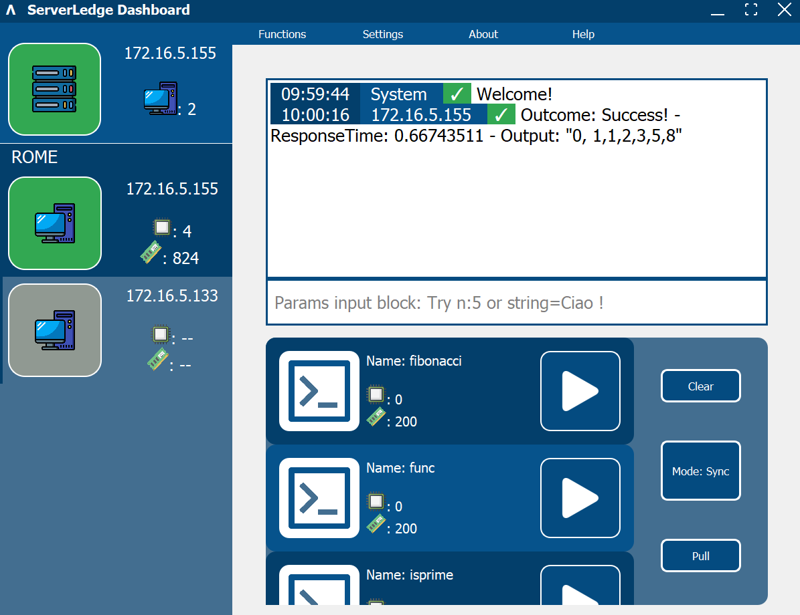
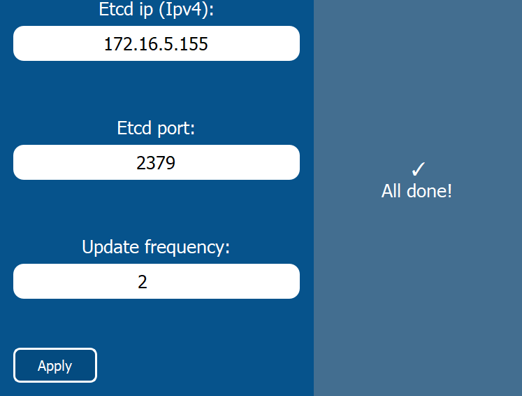

# Serverledge_Demo

Serverledge_Demo is a simple dashboard designed to monitor and test Edge-Cloud environments built on [Serverledge](https://github.com/serverledge-faas/serverledge/tree/main) framework.

## Main functions

1. Detects node connections and disconnections.
2. Display the free resources of each online node.
3. Organizes detected nodes in groups based on location.
4. Detects all available functions.
5. Allows the invocation on a online node of a detected function (sync & async mode).
6. Allows you to specify the invocation input parameters.
7. Displays invocations outcomes.

## Dependencies

Be sure to have Python 3.9 or higher installed.  
(Optional but accomended) Create a virtual environment and use the bash command:

```
pip install -r requirements.txt
```

## File Structure
```
Serverledge_Demo_folder
│   about_and_help_widgets.py
│   conf.txt
│   dynamic_menu_widgets.py
│   functions_widget.py
│   main_ui_widgets.py
│   requirements.txt
│   secondary_threads.py
│   serverledge_dashboard.py
│   serverledge_interface.py
│   serverledge_items_descriptor_widgets.py
│   settings_widgets.py
│   stacked_widgets_widgets.py
│   titlebar_widgets.py
│
└───images
        close.png
        cpu.png
        cpu1.png
        dashboard_logo.png
        etcd.png
        function.png
        globe.png
        invoke.png
        lambda.png
        maximize.png
        minimize.png
        number_computer.png
        offline_icon.png
        online_icon.png
        ram.png
        ram1.png
        server.png
        server1.png
        server2.png
        stemma_unipi.svg.png
```

## Run Serverledge_Demo

```
python serverledge_dashboard.py
```

## Configuration
Serverledge_Demo uses the content of 'conf.txt' file to operate. 'conf.txt' contains in 3 different rows the ip of the ETCD server, the port number of the ETCD server and a number, the row represent the update frequency at which the application send update requests to the Serverledge nodes detected.

NOTE: This config file can be modified within the GUI of Serverledge_Demo in the section 'settings'.

## Rapid guide
NOTE: Available in the application section 'help'.

### Invoke functions


Click on the button 'Function' at the top to enter the functions session. Click on a online icon node to select the node on which invoke the desired function.
Then you can toggle the modality by clicking the 'Mode' button (in the image is setted up to 'Sync'), you can then specify input parameters by following this syntax: 
```
"(Parametername1)[:/=](value1)(space)(Parametername2)[:/=](value2)"
```
Finaly you can click on the 'Play' button of the function element listed at the bottom.
Outcomes will be displayed as soon as possible on the log on top if the modality selected was 'Sync', otherwise you must have selected the same node and click on the 'Pull' button.

NOTE: You can stack Async invocations, be sure to remember on which node they were invoked on.

### Configuration


Click on the button 'Settings' at the top to enter the settings session. The form is very straight up, be sure to click on the 'Apply' button at the end, if all is well it will be displayed an according message on the right session.

## About
For more informations click on the 'About' button at the top.
